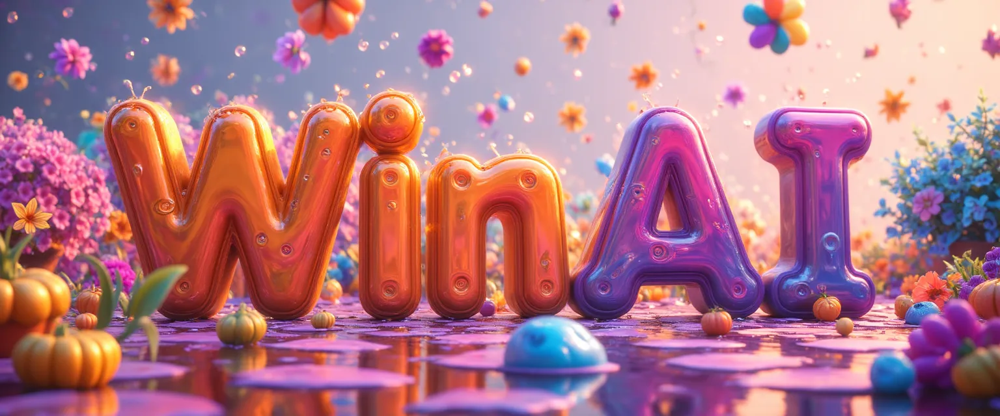
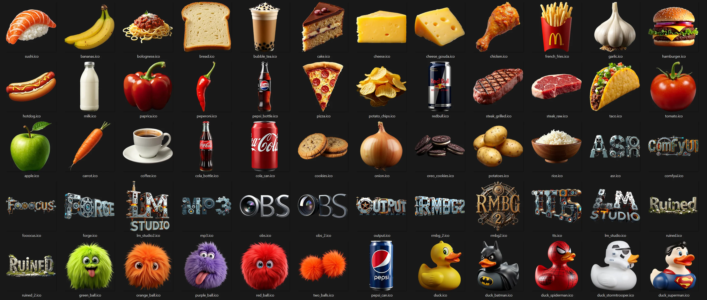
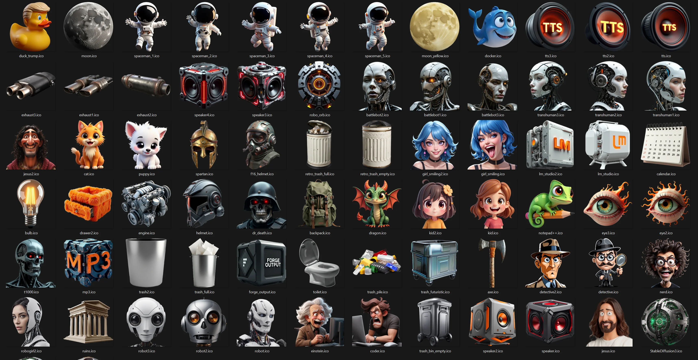

# WinAI-Icons (100+)

# My Journey from Pixels to AI: Crafting Icons Through Time  

It all began in the glow of a CRT monitor, where a young me discovered the magic of digital art. Armed with the earliest versions of Photoshop and a floppy disk full of pixelated dreams, I spent countless hours sketching icons—clumsy at first, then sharper, bolder. Back then, every curve was a battle with the "Pen Tool," and every gradient felt like a triumph.  

Decades later, the tools have evolved, but the passion remains. Today, I collaborate with AI to breathe life into icons that blend precision with creativity. This collection is a testament to that evolution: **modern, clean, and meticulously crafted** designs, all generated and refined with AI. Each icon carries the lessons of those early days—attention to detail, a focus on usability, and a dash of playful experimentation.  

### What’s Here?  
- **AI-Generated Elegance**: Every icon in this repository is born from iterative AI workflows, polished to balance aesthetic simplicity with functional clarity.  
- **Multi-Resolution Ready**: Optimized for versatility, these icons scale seamlessly up to **256×256px**, ensuring crisp visuals across themes, apps, and interfaces.  
- **Your Canvas Awaits**: Whether you’re customizing a project, refreshing a UI, or exploring design frontiers, these icons are yours to adapt, remix, and reimagine.  

From the pixelated beginnings of childhood to the algorithmic dance of AI, this collection bridges eras. Dive in, and let these icons spark your next creative chapter.  

*Made with code, creativity, and a lifetime of curiosity.*  

